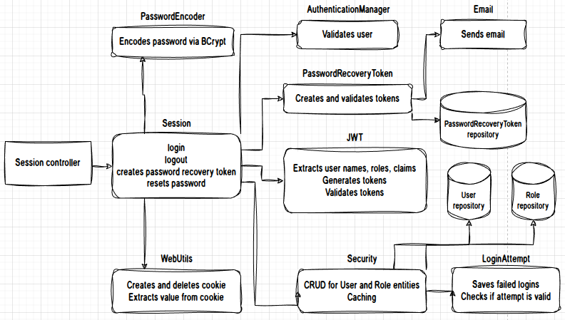
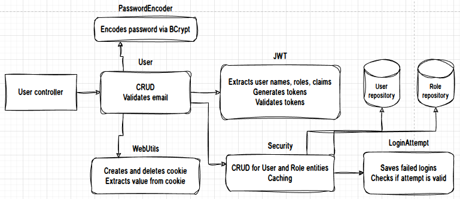
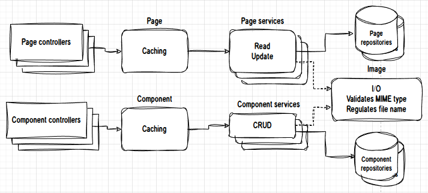

# Description
A back-end web app made with Java/Spring that i base on my every project.

Pages are not creatable and deletable but components are. Each page and component related to at most one image. Accepted image files are svg, webp, gif, jpeg and png. Servlet maximum multipart size is set to 1MB, i minimize images on frontend.

Server side caching happens in PageService, ComponentService and SecurityService. For client side caching i use ETag headers of responses' hashcodes and image files' name. Therefore every image file has LocalDateTime in its name.

Regex patterns for email and password validation are from OWASP foundation.

# Features
- Spring MVC
- Spring JPA, PostgreSQL
- 4 pages
	- About
	- Contact
	- Home
	- Works
- 4 components
	- Carousel Section
	- Simple Card
	- Detailed Card
	- Phone
- 2 localizations
	- English
	- Turkish
- Image service for I/O operations, regulating file name and validating MIME type of the files.
- Caching
	- Client side
	- Server side
- SPA routing
- Stateless session with JWT
- Brute Force Authentication handler
- Forgotten password recovery
- 2 hierarchical user roles
	- Administrator
	- Moderator

# Working Logic
**Session service:**

**User service:**

**Page and Component services:**

